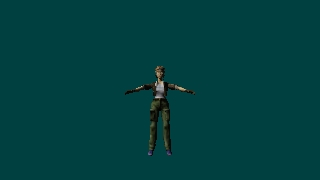
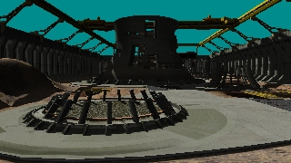
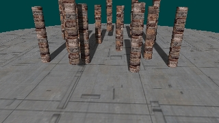
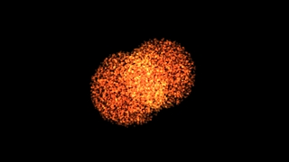

# JeremyAnsel.DirectX-Samples

JeremyAnsel.DirectX-Samples contains samples for JeremyAnsel.DirectX.* APIs.

# Screenshots

DXSDK_Jun10_Direct3D10_DeferredParticles - DeferredParticles 
FeatureLevel100 
This sample shows a method of rendering deferred particles systems. 
 

DXSDK_Jun10_Direct3D10_FixedFuncEmu - FixedFuncEmu 
FeatureLevel100 
This sample attempts to emulate certain aspects of the Direct3D 9 fixed function pipeline in a Direct3D 10 environment. 
 

DXSDK_Jun10_Direct3D10_ShadowVolume10 - ShadowVolume10 
FeatureLevel100 
This sample shows how to use shadow volumes. 
 

DXSDK_Jun10_Direct3D11_AdaptiveTessellationCS40 - AdaptiveTessellationCS40 
FeatureLevel100 
This sample shows how to use Compute Shader 4.0 to do one simple adaptive tessellation scheme. 
 

DXSDK_Jun10_Direct3D11_BasicCompute11 - BasicCompute11 
FeatureLevel110 
Demonstrates the basics to get DirectX 11 Compute Shader (aka DirectCompute) up and running by implementing Array A + Array B. 
 

DXSDK_Jun10_Direct3D11_BasicHLSL11 - BasicHLSL11 
FeatureLevel92 
This sample shows a simple example of the Microsoft Direct3D's High-Level Shader Language (HLSL).  
 

DXSDK_Jun10_Direct3D11_CascadedShadowMaps11 - CascadedShadowMaps11 
FeatureLevel100 
This sample demonstrates cascaded shadow maps. 
 

DXSDK_Jun10_Direct3D11_ComputeShaderSort11 - ComputeShaderSort11 
FeatureLevel110 
Demonstrates how to use compute shaders to perform sorting on the GPU with DirectX 11. 
 

DXSDK_Jun10_Direct3D11_ContactHardeningShadows11 - ContactHardeningShadows11 
FeatureLevel110 
Contact hardening shadows technique which uses sm5.0 instructions. 
 

DXSDK_Jun10_Direct3D11_DDSWithoutD3DX11 - DDSWithoutD3DX11 
FeatureLevel92 
Illustrates loading a DDS file without using D3DX. 
 

DXSDK_Jun10_Direct3D11_EmptyProject11 - EmptyProject11 
FeatureLevel91 
Empty starting point for new Direct3D 11 applications. 
 

DXSDK_Jun10_Direct3D11_FluidCS11 - FluidCS11 
FeatureLevel100 
This sample shows a particle-based fluid simulation. 
 

DXSDK_Jun10_Direct3D11_HDRToneMappingCS11 - HDRToneMappingCS11 
FeatureLevel110 
This sample demonstrates how to use Compute Shader to do post-processing. 
 

DXSDK_Jun10_Direct3D11_NBodyGravityCS11 - NBodyGravityCS11 
FeatureLevel110 
Demonstrates how to use Compute Shader to do n-body gravity computation 
 

DXSDK_Jun10_Direct3D11_OIT11 - OIT11 
FeatureLevel110 
Demonstrates an Order Independent Transparency algorithm in D3D11 using Compute Shaders and scattered writes. 
 

DXSDK_Jun10_Direct3D11_PNTriangles11 - PNTriangles11 
FeatureLevel110 
This code sample demonstrates the use of DX11 Hull & Domain shaders to implement the PN-Triangles tessellation. 
 

DXSDK_Jun10_Direct3D11_SimpleBezier11 - SimpleBezier11 
FeatureLevel110 
This sample shows an simple implementation of the DirectX 11 Hardware Tessellator for rendering a Bezier Patch. 
 

DXSDK_Jun10_Direct3D11_SimpleSample11 - SimpleSample11 
FeatureLevel91 
Starting point for new Direct3D 11 samples. For a more basic starting point, use the EmptyProject11 sample instead. 
 

DXSDK_Jun10_Direct3D11_SubD11 - SubD11 
FeatureLevel110 
This sample shows an implementation of Charles Loop's and Scott Schaefer's Approximate Catmull-Clark subdvision. 
 

DXSDK_Jun10_Direct3D11_Tutorials - Tutorial01 
FeatureLevel91 
This application demonstrates creating a Direct3D 11 device. 
 

DXSDK_Jun10_Direct3D11_Tutorials - Tutorial02 
FeatureLevel91 
This application displays a triangle using Direct3D 11. 
 

DXSDK_Jun10_Direct3D11_Tutorials - Tutorial03 
FeatureLevel91 
This application displays a triangle using Direct3D 11. 
 

DXSDK_Jun10_Direct3D11_Tutorials - Tutorial04 
FeatureLevel91 
This application displays a 3D cube using Direct3D 11. 
 

DXSDK_Jun10_Direct3D11_Tutorials - Tutorial05 
FeatureLevel91 
This application demonstrates animation using matrix transformations. 
 

DXSDK_Jun10_Direct3D11_Tutorials - Tutorial06 
FeatureLevel91 
This application demonstrates simple lighting in the vertex shader. 
 

DXSDK_Jun10_Direct3D11_Tutorials - Tutorial07 
FeatureLevel91 
This application demonstrates texturing. 
 

DXSDK_Jun10_Direct3D11_VarianceShadows11 - VarianceShadows11 
FeatureLevel100 
This sample demonstrates variance shadow maps. 
 

DXSDK_Jun10_Misc_Collision - Collision 
FeatureLevel91 
This sample demonstrates collisions using the DXMath Collision API. 
 

GameWindowSamples - Direct2DAndDWrite 
FeatureLevel91 
This sample shows how to use Direct2D and DirectWrite. 
 

GameWindowSamples - GPUProfiler 
FeatureLevel91 
This sample shows how to measure a DirectX app. 
 

GameWindowSamples - WpfHost 
FeatureLevel91 
This sample shows how to host a DirectX window in a WPF app. 
 

WindowsSamples - Lesson1.Basics 
FeatureLevel91 
This tutorial sample sets up DirectX resources. 
 

WindowsSamples - Lesson2.Triangles 
FeatureLevel91 
This tutorial sample creates a 3D cube from a mesh using a vertex shader. 
 

WindowsSamples - Lesson3.Cubes 
FeatureLevel91 
This tutorial sample applies basic vertex lighting and coloring to the cube primitive created in Lesson 2. 
 

WindowsSamples - Lesson4.Textures 
FeatureLevel91 
This tutorial sample loads DDS textures and applies them to a 3D primitive by using the cube created in Lesson 3. It also introduces a simple dot-product lighting model. 
 

WindowsSamples - Lesson5.Components 
FeatureLevel91 
This tutorial sample takes the concepts from the previous four lessons and demonstrates how to separate them into separate code objects for reuse. 
 

