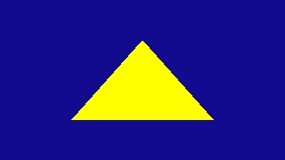

# JeremyAnsel.DirectX-Samples

JeremyAnsel.DirectX-Samples contains samples for JeremyAnsel.DirectX.* APIs.

# Screenshots

GameWindowSamples - Direct2DAndDWrite 
 
This sample shows how to use Direct2D and DirectWrite. 

GameWindowSamples - GPUProfiler 
 
This sample shows how to measure a DirectX app. 

GameWindowSamples - WpfHost 
 
This sample shows how to host a DirectX window in a WPF app. 

WindowsSamples - Lesson1.Basics 
 
This tutorial sample sets up DirectX resources. 

WindowsSamples - Lesson2.Triangles 
 
This tutorial sample creates a 3D cube from a mesh using a vertex shader. 

WindowsSamples - Lesson3.Cubes 
 
This tutorial sample applies basic vertex lighting and coloring to the cube primitive created in Lesson 2. 

WindowsSamples - Lesson4.Textures 
 
This tutorial sample loads DDS textures and applies them to a 3D primitive by using the cube created in Lesson 3. It also introduces a simple dot-product lighting model. 

WindowsSamples - Lesson5.Components 
 
This tutorial sample takes the concepts from the previous four lessons and demonstrates how to separate them into separate code objects for reuse. 

